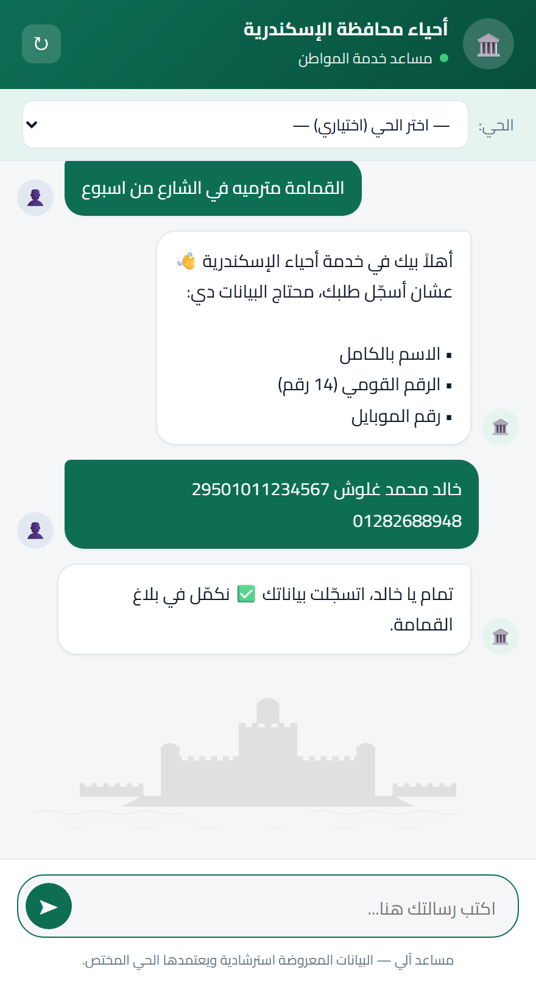
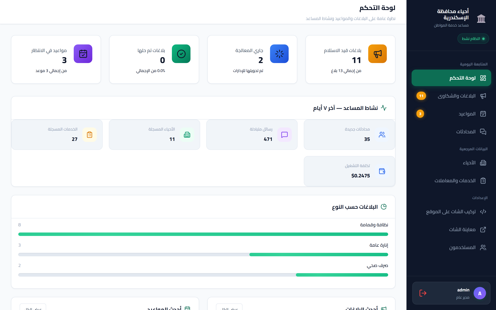
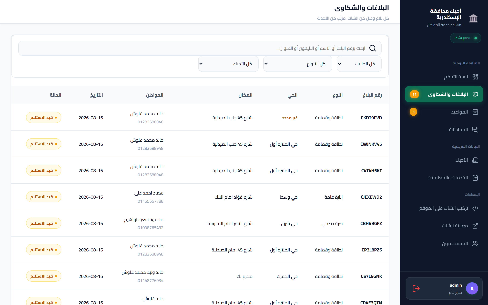
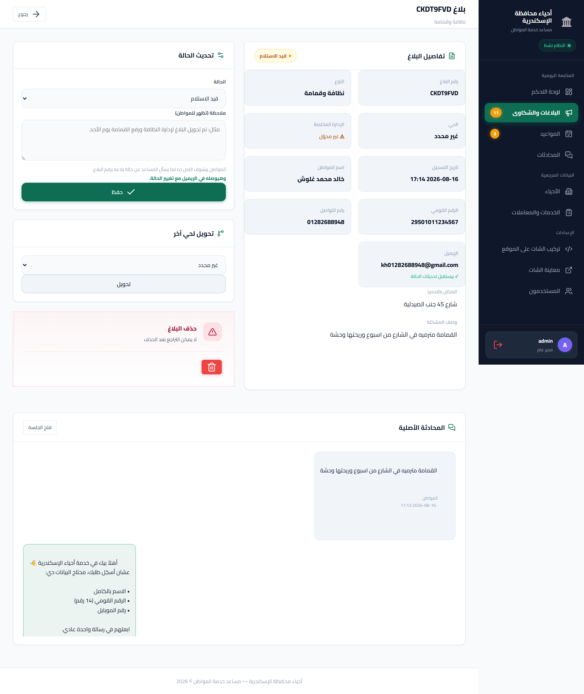
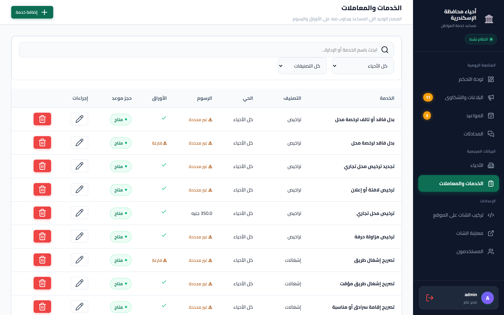
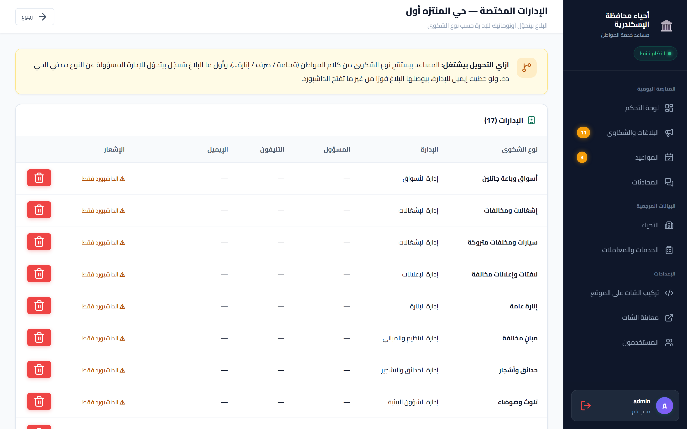
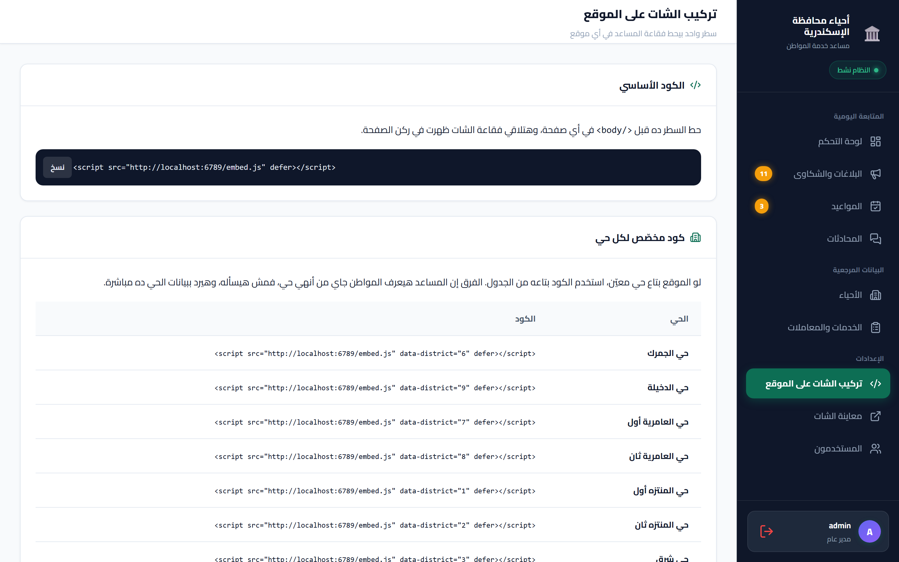

<div align="center">

# مساعد خدمة المواطن — أحياء الإسكندرية

**شات بوت للمواقع بيستقبل بلاغات المواطنين، بيجاوب على أسئلة الخدمات من قاعدة بيانات معتمدة، بيحجز مواعيد، وبيحوّل كل بلاغ للإدارة المختصة أوتوماتيك.**


</div>

---

## نظرة سريعة

<div align="center">

</div>

المواطن بيكتب مشكلته بلغته العادية. النظام بيسجّل بياناته، بيستنتج نوع الشكوى والحي، بيعرض ملخص للمراجعة، وبعد التأكيد بيطلّع رقم مرجعي ويحوّل البلاغ للإدارة المسؤولة — وبيبعت إيميل للمواطن وللإدارة.

**٤ رسائل من المواطن** من أول كلمة لرقم بلاغ محوّل.

---

## الخدمات

| الخدمة | المواطن بيعمل إيه | النتيجة |
|---|---|---|
| **تقديم بلاغ** | بيوصف المشكلة بلغته | رقم بلاغ + تحويل للإدارة + إيميل |
| **الاستعلام** | بيسأل عن أوراق أو رسوم أو مدة | رد من قاعدة البيانات المعتمدة فقط |
| **حجز موعد** | بيطلب ميعاد لمعاملة | رقم موعد + بطاقة PNG + إيميل |
| **متابعة الطلب** | بيبعت رقم البلاغ أو موبايله | الحالة الحالية وملاحظة الموظف |

---

## التشغيل

### المتطلبات

- [Docker Desktop](https://www.docker.com/products/docker-desktop/)
- مفتاح [Groq API](https://console.groq.com/keys) — مجاني للتجربة

### الخطوات

```bash
git clone https://github.com/khaled-dotcom/alexandria-districts-assistant.git
cd alexandria-districts-assistant

cp .env.example .env
```

افتح `.env` واملأ ٣ قيم:

```bash
SECRET_KEY=                 # ولّده: python -c "import secrets; print(secrets.token_hex(32))"
GROQ_API_KEY=               # من console.groq.com/keys
POSTGRES_PASSWORD=          # أي كلمة سر قوية
```

وبعدين:

```bash
docker compose up -d --build
```

> ⏳ **أول تشغيل بياخد وقت.** النظام بينزّل موديل البحث الدلالي (٢.٢ جيجا) قبل ما السيرفر يبدأ. بينزل مرة واحدة ويتخزن في volume، فأي تشغيل بعد كده بيقوم في ثواني.

املأ البيانات الأولية:

```bash
docker compose exec web flask seed-districts --with-services   # ١١ حي + ٢٤ خدمة
docker compose exec web flask seed-departments                 # إدارة لكل تصنيف
docker compose exec web flask create-admin                     # مستخدم للوحة التحكم
```

خلاص:

| | |
|---|---|
| 💬 **الشات** | http://localhost:6789/chat |
| 🏛️ **لوحة التحكم** | http://localhost:6789/dashboard |

---

## لوحة التحكم

<div align="center">

</div>

نظرة عامة على البلاغات والمواعيد ونشاط المساعد، مع توزيع البلاغات حسب النوع وتكلفة التشغيل.

### البلاغات

<div align="center">

</div>

كل بلاغ وصل من الشات، بفلترة بالحالة والنوع والحي. اضغط على أي صف تفتح صفحة البلاغ — وفيها **نص المحادثة الأصلية كاملة** اللي طلع منها البلاغ.

<div align="center">

</div>

الملاحظة اللي بيكتبها الموظف بتوصل المواطن — بيشوفها لما يسأل المساعد عن الحالة، وبتتبعتله في الإيميل مع تغيير الحالة.

### الخدمات

<div align="center">

</div>

المصدر الوحيد اللي المساعد بيجاوب منه. علامة ⚠ بتوري الخانات الناقصة — والمساعد بيقول للمواطن «ما عنديش المعلومة» بدل ما يخترع.

### الإدارات المختصة

<div align="center">

</div>

كل تصنيف شكوى مربوط بإدارة في كل حي. البلاغ بيتحوّل أوتوماتيك حسب نوعه، ولو الإدارة ليها إيميل بيوصلها البلاغ فورًا.

---

## التشغيل جوه موقع حي وسط

المجلد ده جزء من مستودع موقع حي وسط، والموقع بيتكلم معاه سيرفر لسيرفر — مش من
المتصفح. يعني الخدمة دي **مالهاش بورت مفتوح على النت** في الـ`docker-compose.yml`
اللي في جذر المستودع؛ كل حاجة المواطن محتاجها بتوصله من `/api/chat` بتاع الموقع
نفسه، وبطاقة الموعد بترجع عن طريق `/api/chat/ticket/[reference]` على نفس الدومين.

```bash
# من جذر المستودع
cp .env.example .env
docker compose up -d --build
```

### قاعدة المعرفة بتيجي من الموقع

الموقع هو مصدر الحقيقة للخدمات: الأوراق والخطوات والمدد والسند القانوني كلها متكتوبة
في `content/` ومعروضة للمواطن على صفحة يقدر يفتحها. المساعد بيجاوب من قاعدة بياناته
هو بس، فلازم اللي منشور على الموقع يوصل للقاعدة دي — وإلا الشات والصفحة هيقولوا
للمواطن كلامين مختلفين.

```bash
npm run knowledge:export                               # الموقع → JSON
docker compose exec agent flask import-site-knowledge  # JSON  → الأحياء والخدمات والمتجهات
```

مفيش حرف في العملية دي بيتولّد من موديل. الأمر بيكتب الوصف والمرادفات والكلمات
المفتاحية من نص الحي نفسه وبعدين يبني الـembedding، فبيتخطّى مرحلة التوليد
والاعتماد اللي لوحة التحكم بتستخدمها — وده اللي بيخلّي الاستيراد ثابت وقابل
للإعادة. `--no-embed` بيحمّل الكتالوج من غير المتجهات (بحث نصي بس)،
و`--prune` بيوقّف الخدمات اللي الموقع بطّل ينشرها — بيوقّفها ما بيمسحهاش، لأن في
بلاغات ومواعيد مربوطة بيها.

أعِد تشغيل الأمرين بعد أي تعديل في محتوى الموقع.

---

## التضمين في موقع

<div align="center">

</div>

سطر واحد قبل `</body>`:

```html
<script src="https://YOUR-HOST/embed.js" defer></script>
```

ولو الموقع بتاع حي معيّن، ضيف رقمه فالبوت يعرف المواطن جاي منين وما يسألهوش:

```html
<script src="https://YOUR-HOST/embed.js" data-district="3" defer></script>
```

| الخاصية | الوظيفة | الافتراضي |
|---|---|---|
| `data-district` | رقم الحي | — |
| `data-position` | `left` أو `right` | `left` |
| `data-color` | لون الفقاعة | `#0d6e54` |
| `data-label` | نص التلميح | تحتاج مساعدة؟ |

الشات بيتحمّل في `iframe` معزول، وما بيتحمّلش غير أول ما المواطن يضغط الفقاعة — فموقع الحي ما بيبطّأش.

---

## إزاي بيشتغل

```
رسالة المواطن
     ↓
   intent  ─┬─ inquiry     → rag →  رد من قاعدة المعرفة
            ├─ appointment → rag →  فورم حجز في الشات
            ├─ complaint   ──────→  فورم بلاغ في الشات
            ├─ track       ──────→  حالة الطلب (من غير نداء موديل)
            └─ direct      ──────→  ترحيب وبيانات الأحياء

فورم اتملى (POST /api/forms/<kind>)
     ↓
  graph/forms.py  →  تحقق كامل  →  حفظ + رقم مرجعي + بطاقة PNG
```

### ليه فورم مش سؤال وجواب

الحجز والبلاغ محتاجين سبع حقول. جمعهم بالمحادثة معناه سبع لفّات بين المواطن
والموديل، وكل لفّة فيها احتمال إن الموديل يسأل تاني على حاجة اتقالت، أو يقرا
كلمة «تمام» اترمت في أي سياق على إنها تأكيد على بيانات المواطن مشافهاش.

وكان فيه بوابة تسجيل قبل التصنيف كمان: أي رسالة والبيانات ناقصة كانت بتروح
لعقدة استقبال بتسأل على الاسم والرقم القومي والتليفون — يعني مواطن بيسأل
«الحي بيفتح الساعة كام؟» كان بيترد عليه بطلب رقمه القومي.

دلوقتي كل رسالة بتروح على التصنيف على طول. والحجز والبلاغ بيفتحوا **فورم**
جوّه الشات: المواطن بيشوف كل الحقول مرة واحدة، بيصلّح اللي الموديل ملاه غلط،
وبيبعت. والحفظ بيعدّي على `graph/forms.py` — كود بيتحقق من كل حقل قدام قوايم
الأحياء والخدمات والأيام المفتوحة والخانات الفاضية. مفيش موديل ليه رأي في
إن الصف يتكتب.

مواعيد الشباك (`BOOKING_*` في `.env.example`) بتتولّد من نفس سياسة الموقع:
الأحد للخميس، ٩ ص لـ ١:٣٠، كل نص ساعة، والحجز مفتوح من بكرة لـ ٢١ يوم. الخانة
المحجوزة بتتشال من القايمة، وبتتراجع تاني وقت الحفظ عشان اتنين ما يقفوش على
نفس الشباك.

### الذاكرة — ثلاث طبقات

| الطبقة | بتخزن إيه | بتعيش قد إيه |
|---|---|---|
| **الملخص** | سياق المحادثة | بيتجدد كل دور |
| **المسودة** | حقول الطلب الحالي (JSON) | بتتمسح بعد الحفظ |
| **الهوية** | اسم · رقم قومي · تليفون · إيميل | طول الجلسة |

الهوية بتتخزن أول ما المواطن يبعت فورم، فالفورم اللي بعده بيوصله **متملّي
ببياناته** — بلاغ النهاردة وحجز بعده بدقيقة ما بيتكتبوش مرتين.

### البحث — محركين

- **نصي** (rapidfuzz + n-gram) — بيمسك الأخطاء الإملائية والمرادفات المسجّلة
- **دلالي** (pgvector + موديل محلي ١٠٢٤ بُعد) — بيمسك المعنى

«فاتح سوبر ماركت جديد ومحتاج اعرف الورق» بتوصل لـ«ترخيص محل تجاري» رغم إن مفيش حرف مشترك.

> **قاعدة تمنع الهلوسة:** البحث بيرجّع **معرّفات** بس. الرسوم والأوراق بتتقرأ من الجدول مباشرة — فمستحيل رقم يتغيّر في الطريق.

---

## البنية

```
app.py                      Flask — الشات API + لوحة التحكم + أوامر CLI
service/message_processor   الوسيط بين الـAPI والوكيل

graph/                      عقل الوكيل (LangGraph)
  agent_graph.py            الرسم البياني والتوجيه
  forms.py                  وصف فورمات الشات + التحقق + الحفظ
  nodes/intent_node.py      تصنيف النية + توليد استعلامات البحث
  nodes/complaint_node.py   بيفتح فورم البلاغ
  nodes/appointment_node.py بيفتح فورم الحجز
  nodes/inquiry_node.py     الرد من قاعدة المعرفة
  nodes/track_node.py       المتابعة — من غير LLM
  nodes/direct_node.py      ترحيب وبيانات الأحياء

llm/model.py                Groq + سلسلة موديلات احتياطية
llm/embeddings.py           موديل البحث الدلالي المحلي

search/                     البحث النصي + الدلالي + إزالة التكرار
rag/context_builder.py      تحويل نتائج البحث لنص يقرأه الوكيل
knowledge/                  توليد الوصف والمرادفات + المتجهات

software_services/          طبقة الوصول للداتابيز
notified_center/            إيميلات المواطن والإدارة
models/models.py            الجداول
templates/                  لوحة التحكم + صفحات الشات
```

---

## التقنيات

| الطبقة | المستخدم |
|---|---|
| **الويب** | Flask · Jinja2 · gunicorn |
| **الوكيل** | LangGraph · langchain-groq · Pydantic |
| **الفهم والرد** | Groq — `openai/gpt-oss-120b` مع سلسلة احتياطية |
| **البحث الدلالي** | fastembed (ONNX محلي) · `intfloat/multilingual-e5-large` |
| **البحث النصي** | rapidfuzz + n-gram |
| **التخزين** | PostgreSQL 16 + pgvector |
| **الفرونت إند** | HTML/CSS/JS خام — صفر مكتبات في الشات |
| **البطاقات** | Pillow + arabic-reshaper + python-bidi |

**ليه موديل بحث محلي؟** Groq بيقدّم موديلات محادثة بس — مالوش endpoint للـembeddings. الموديل المحلي معناه مفيش مفتاح تاني، مفيش تكلفة، ومفيش استدعاء شبكة في مسار البحث.

---

## أوامر CLI

```bash
flask init-db                            إنشاء الجداول والهجرات
flask seed-districts [--with-services]   أسماء الأحياء والخدمات
flask seed-departments [--district ID]   إدارة لكل تصنيف شكوى
flask import-site-knowledge              قاعدة المعرفة من موقع الحي
flask create-admin [--district ID]       مستخدم للوحة التحكم
flask list-admins
flask delete-admin
flask warm-embeddings                    تحميل موديل البحث مسبقًا
flask purge-sessions --days 90           حذف المحادثات القديمة
```

موظف مربوط بحي بيشوف بلاغات ومواعيد حيه بس. سيب `--district` فاضي عشان يبقى مدير عام.

---

## الإعدادات

كلها في `.env` — شوف [`.env.example`](.env.example) للقائمة الكاملة.

| المتغيّر | الوظيفة | الافتراضي |
|---|---|---|
| `SECRET_KEY` | توقيع الجلسات — **إجباري** | — |
| `GROQ_API_KEY` | الفهم والرد — **إجباري** | — |
| `SQLALCHEMY_DATABASE_URI` | رابط قاعدة البيانات | — |
| `GROQ_MODEL` | الموديل الأساسي | `openai/gpt-oss-120b` |
| `GROQ_MODEL_FALLBACKS` | البدائل عند فشل الأساسي | ٣ موديلات |
| `EMBEDDING_MODEL` | موديل البحث الدلالي | `multilingual-e5-large` |
| `ALLOWED_ORIGINS` | المواقع المسموح لها بالتضمين | `*` |
| `CHAT_RATE_LIMIT` | رسائل/دقيقة لكل جلسة و IP | `12` |
| `SECURE_COOKIES` | `0` للتطوير على http | `1` |

### إشعارات الإيميل (اختياري)

```bash
SMTP_SERVER=smtp.gmail.com
SMTP_PORT=465
NOTIFICATION_EMAIL_SENDER=you@gmail.com
NOTIFICATION_EMAIL_PASSWORD=xxxx xxxx xxxx xxxx   # App Password مش باسورد الحساب
```

من غيرها النظام بيشتغل عادي — الإشعارات بس مش هتتبعت.

---

## قبل التشغيل الحقيقي

- [ ] **املأ بيانات الأحياء** — خصوصًا **النطاق الجغرافي** (أسماء المناطق والشوارع). من غيره البوت هيسأل «انت تابع لأنهي حي؟» في كل بلاغ بدل ما يعرف من اسم الشارع.
- [ ] **راجع الأوراق والرسوم.** الأوراق المسجّلة هي المتعارف عليه، والرسوم مسيبة فاضية عن قصد — دي أرقام رسمية بتتغير بقرارات.
- [ ] **حط تليفونات وإيميلات الإدارات** عشان البلاغ يوصلها فورًا.
- [ ] **HTTPS** و `SECURE_COOKIES=1`.
- [ ] **`ALLOWED_ORIGINS`** بمواقع الأحياء بدل `*`.
- [ ] **نسخ احتياطي** لـ `pgdata`.
- [ ] **خطة Groq مدفوعة** — الحصة المجانية بتكفي ٧-١٠ بلاغات في اليوم.

---

## الأمان

- كلمات المرور بـ **scrypt** مش نص عادي
- **CSRF** بفحص `Origin` على كل طلب كتابة
- الكوكي **HttpOnly + SameSite + Secure** وينتهي بعد ١٢ ساعة
- **حد معدل** في قاعدة البيانات — مشترك بين عمال gunicorn
- كل قيمة في الإيميلات **متهرّبة** — وصف الشكوى بيكتبه المواطن
- ردود المساعد بتتعرض بـ `textContent` مش `innerHTML`

---

## رخصة

الاستخدام والتعديل مسموح للجهات الحكومية والمشاريع غير الربحية.
